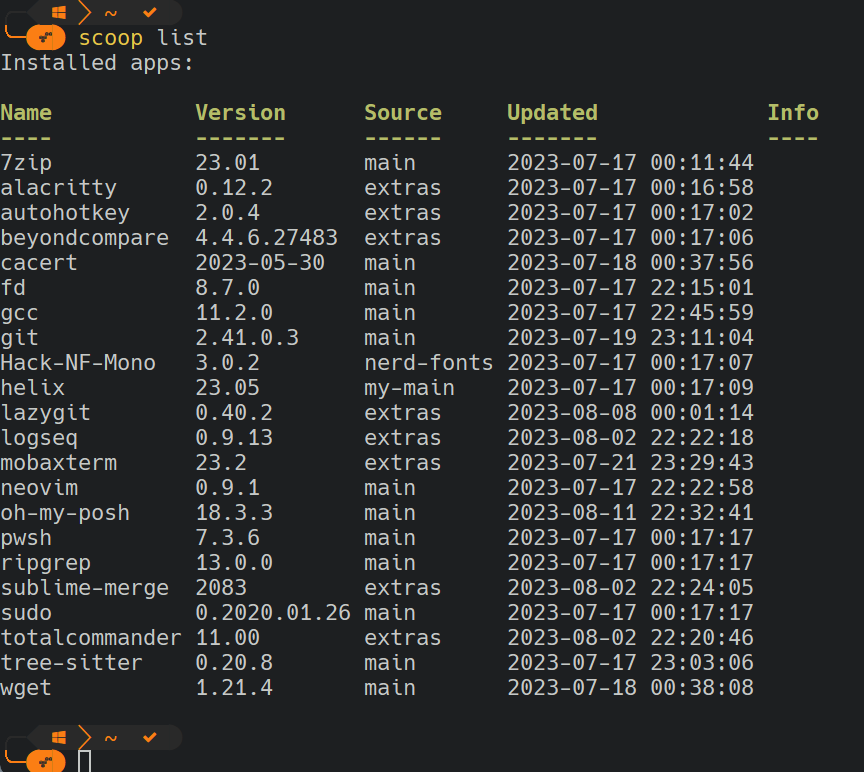

[Scoop](https://scoop.sh) provides a wonderful foundation for creating a portable developer's toolkit on Windows systems.

## What is Scoop?

Scoop is a command-line installer for Windows. It is created from Powershell scripts, so it installs easily with few dependencies on Windows-powered systems. The premier benefit of Scoop over other Windows installers (e.g., Chocolaty, Winget, etc.) is that it installs everything to a single directory under the user profile.

Scoop stores configuration data that should persist between software updates in a persistent data directory. This directory is an excellent candidate to store in a private repository somewhere.

> [!NOTE]
> Of course, this repository can be public. I tend to store license/registration keys in this directory, so I made mine private.

## Creating your toolkit

To create your toolkit, first, install Scoop and then use it to install the utilities--development or otherwise--that you use.

Once everything is installed and configured to your liking, create a Git repository in the Scoop persist directory. It should be located under **scoop/persist** in your Windows home directory.

This repository will allow you to back up your application configurations and import them on other machines, giving you an identical work environment across devices.

Before pushing your Git repository to some remote server, save a list of all the apps installed in Scoop to make them easy to install on other machines. Do this by running `scoop export > scoopfile.json` in the **persist** directory. Make sure to commit the **scoopfile.json** file. On other devices, you can install all your apps by running `scoop import scoopfile.json`.

## Cloning your toolkit

The process to create a copy of your work environment is as simple as the following steps:

1. Install Scoop
2. Install Git via Scoop: `scoop install git`
3. Checkout your Scoop persist repository to **$HOME/scoop/persist**
4. Install your Scoop packages: `scoop import $HOME\scoop\persist\scoopfile.json`

## Enjoy!

I find that using the same tools and configurations on any machine I work on allows me to become as efficient as possible with these tools. In my opinion, Scoop provides the easiest way to create an environment that can be easily synced across all of my development computers.
